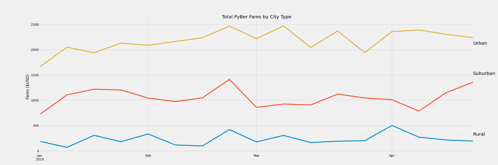

# PyBer with Matplotlib

## Overview of the PyBer City Type Analysis

### PyBer ride sharing app company wants an analysis of their data by city type (Urban, Suburbam or Rural). Company leaders want a summary of the differences by the city type and some recommendations based on the differences. The results are presented in graphic and tabular form.
`  ` 
## Deliverable 1: Code analysis and output
- Total rides for each city type
```python
ride_count = pyber_data_df.groupby("type").count()["ride_id"]
```
- Total driver for each city type
#### This code had take into account that the total sum of drivers by type would over count the number of drivers. Cities were listed more than once for mulitple ride_id's. So the total drivers per type had to only count each city's drivers once. I used a new method, drop_duplicates(), to do that unique sum.
```python
# https://stackoverflow.com/questions/56220045 how-to-sum-distinct-rows-in-a-pandas-dataframe
driver_count = pyber_data_df.drop_duplicates(["city","type"]).groupby(["type"]).sum()["driver_count"]
```
- Total fares for each city type
```python
total_fare = pyber_data_df.groupby("type").sum()["fare"]
```
- Average fares per ride for each city type
```python
fare_per_ride = total_fare / ride_count
```
- Average fares per driver for each city type
```python
fare_per_driver = total_fare / driver_count
```


### PyBer Summary DataFrame-Unformatted
 
### PyBer Summary DataFrame-Formatted
 

## Deliverable 2: Code analysis and output

- DataFrame using groupby() on type and date summing the fares, resetting index, and changing date to datetime
```python 
fares_by_date = pyber_data_df.groupby(["date","type"]).sum()["fare"]
fares_by_date_df = fares_by_date.reset_index()
fares_by_date_df['date']= pd.to_datetime(fares_by_date_df['date'])
```
- Create a DataFrame using pivot()
```python
fares_by_date_pivot = fares_by_date_df.pivot(index="date", columns="type", values="fare")
```
- Create a DataFrame limiting the dates to a certain range
```python
fares_Jan_Apr = fares_by_date_pivot.loc['2019-01-01':'2019-04-29']
```
- Create a DataFrame using resample() to create weekly bins of the fare sums
```python
weekly_fares_df = fares_Jan_Apr.resample('W').sum()
```
- Line chart of the weekly fare totals per week by city type


- Same chart with lines labeled directly and no legend for better readability



## Extra analyses

1. Total Rides by City Type

1. Total Drivers by City Type

1. Total Fares by City Type

1. Average Fares/Ride by City Type

1. Average Fares/Driver by City Type


## Results Summary
1. Based on the time series line chart, it is clear that Urban cities make the most money in total fares. Urban cities have 5 to 30 times the total fares compared to Rural Cities. Total fares for Urban compared to Suburban range from 2 to 3 times higher over time. Urban cities have peak fares in late Feb and early March. Suburban fares also have a peak in late Feb. Rural fares have a peak in early April but also have the lowest weekly fares over time. 
` `  
1. The extra analysis shown in graph 1 shows a very strong portion of the PyBer business is in Urban cities. There are 13 times more rides in Urban cities compared to Rural ones. The number of Urban rides are almost 3 times higher than in suburban cities. This makes sense because of sheer volume of potential riders. 
1. Bar chart 2 shows a very large difference in the number of drivers by city type. There are more than 30 times the number of drivers in Urban cities compared to Rural (5 times as many suburban drivers).
1. Bar chart 3 illustrates the differences in total fares by city type. Urban cities collect twice and much fare revenue as Suburban cities and 9 times as much as Rural cities.
` `  
1. Extra graphs 4 and 5 show an opposite relationship than total rides, fares and drivers. Rural cities have the highest fare per ride and fare per driver. Suburban cities rank second in these charts. 

## Recomendations
1. PyBer needs to run more promotions in Jan and early Feb to boost the number of riders during those lower fare weeks. 

1. This same time series analysis needs to be run for the rest of the year to look for other seasonal trends where low fares are seen. 
` `  
1. Rural populations tend to be older so campaigns may be developed to show the advantages of using PyBer (increased freedom and independence, not relying on others for rides). Targeting these populations could increase rider numbers in Rural cities. Scheduled pick-ups for retired non-drivers to transport them to recreation sites, churches and other regular gatherings could bring steady stream of fares.

1. PyBer needs to do some recruiting of drivers in the Suburban and Rural cities. They need to look at the cost benefit of giving drivers more money in Rural and Suburban areas to attract more drivers.
` `  
1. To increase revenue, PyBer could consider raising fares in Urban cities. This may be difficult with increased competition. PyBer should look at market share in Urban cities compared to other companies to see if increasing fares would make sense.

1. The suburban market shows a lot of potential money for PyBer. The average fare per ride is 25% highr than the Urban value. There is a lot of convenience associated with ride share apps. PyBer may want to develop a ride share "pack" that people could purchase and use as needed (eg 10 pack discounted). PyBer could consider carpool services to drive mulitple kids to schools, sports practices, rehearsals, etc. These could be run on a schedule to have a steady dtream of consistent fare revenue.
