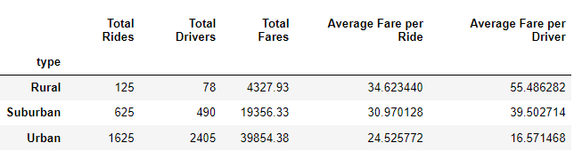

# PyBer with Matplotlib

## Overview of the PyBer City Type Analysis

### PyBer ride sharing app company wants an analysis of their data by city type (Urban, Suburbam or Rural). Company leaders want a summary of the differences by the city type and some recommendations based on the differences. The results are presented in graphic and tabular form.

### Deliverable 1: Code analysis and output
- Total rides for each city type
```python
ride_count = pyber_data_df.groupby("type").count()["ride_id"]
```
- Total driver for each city type
#### This code had take into account that the total sum of drivers by type would over count the number of drivers. Cities were listed more than once for mulitple ride_id's. So the total drivers per type had to only count each city's drivers once. I used a new method, drop_duplicates(), to do that unique sum.
```python
# https://stackoverflow.com/questions/56220045 how-to-sum-distinct-rows-in-a-pandas-dataframe
driver_count = pyber_data_df.drop_duplicates(["city","type"]).groupby(["type"]).sum()["driver_count"]
```
- Total fares for each city type
```python
total_fare = pyber_data_df.groupby("type").sum()["fare"]
```
- Average fares per ride for each city type
```python
fare_per_ride = total_fare / ride_count
```
- Average fares per driver for each city type
```python
fare_per_driver = total_fare / driver_count
```


### PyBer Summary DataFrame-Unformatted
 
### PyBer Summary DataFrame-Formatted
 

### Deliverable 2: Code analysis and output

- DataFrame using groupby() on type and date summing the fares, resetting index, and changing date to datetime
```python 
fares_by_date = pyber_data_df.groupby(["date","type"]).sum()["fare"]
fares_by_date_df = fares_by_date.reset_index()
fares_by_date_df['date']= pd.to_datetime(fares_by_date_df['date'])
```
- Create a DataFrame using pivot()
```python
fares_by_date_pivot = fares_by_date_df.pivot(index="date", columns="type", values="fare")
```
- Create a DataFrame limiting the dates to a certain range
```python
fares_Jan_Apr = fares_by_date_pivot.loc['2019-01-01':'2019-04-29']
```
- Create a DataFrame using resample() to create weekly bins of the fare sums
```python
weekly_fares_df = fares_Jan_Apr.resample('W').sum()
```
- Line chart of the weekly fare totals per week by city type


- Same chart with lines labeled directly and no legend for better readability


